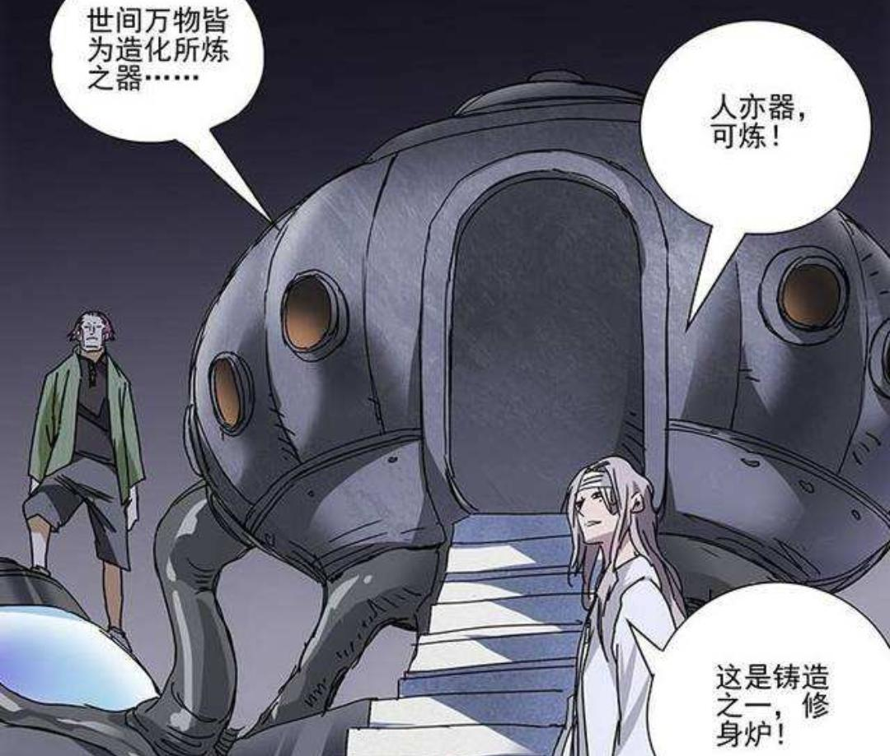
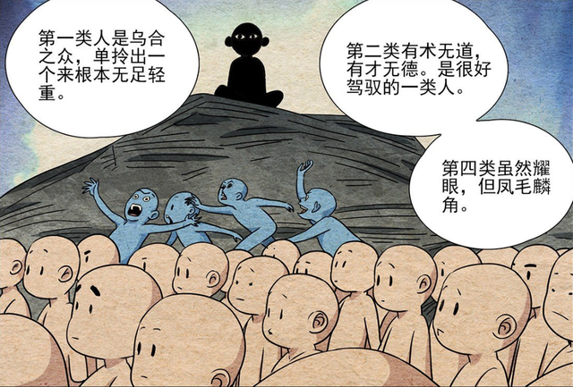

# Self-ReinforcingFurnace(修身炉)
The Ways and tools to improve yourself(修身炉的可操作实现方式)

## 零、介绍

### 0.1 引子

最近在看《一人之下》漫画，感叹于作者米二对于“异人”的描绘与表现，由好奇开始到后来的不断深入了解，也引发了很多思考和触动。
记得无根生问了金凤婆婆一个问题：全性的掌门意味着什么，要想解答这个问题就必须了解全性是什么，在世人看来，全性是一帮尊杨朱为祖，无视世间规则的为所欲为之人，但在无根生看来却并非如此，无根生将芸芸众生根据术与道分为了四类人。

**这里的术可以是异术也可以是能力，而道则是活着的意义或目标。**

第一类最为平凡且数量最多，这些作为大多数活着的人，属于无术无道的一类，而在这些凡人最脱胎而出的精英就是第二类人，他们有着相对出色的技术与能力，但却不知为何而活，是为有术无道。第四类人是为有术有道，这些人有绝对的能力，而且明确自己应该做什么，无论事情成败，他们都可以为了自己的目标而付出一切，而第三类人最让人在意，他们有术而且知道有道，但却因为种种原因而没有达成自己想要的目标。**第三类人的危险之处在于他们身具神通，但却始终找不到自己的道，这些人又不甘就此平凡一生，因此总会去搞事情，而这些破坏的人必然会被世人所排斥，因此全性就成为这些人的集合地。**

因为这第三类人找不到自己的道，就把杨朱的不拔一毛不取一毫当成了自己的道，去肆意发泄自己的能力，漫画到此戛然而止，全性掌门的答案并未揭晓，但结合无根生的这些分类，全性掌门的意义早已揭晓，**全性掌门存在的真正意义就是替这些迷途的全性门人找回他们各自的道，并且引导他们走上这条路，这里也解答了梁挺感谢无根生的原因，无根生引导梁挺、莫明居士找到了自己的道，并且让他们达成了自己人生的真正目标。**

### 0.2 “修身炉”的打开方式

事实上，“异人”分成很多种，有些是先天，有些是后天，但是更多的是无法找到自己的“道”与“术”的普通人。
那么普通人想要成为“异人”的后天方式只能是找准某个方向，不断地去突破自己，由此碧游村马村长所做的“修身炉”便是其中一种方式。
回归现实，我们可以类似地，参考古代修身齐家治国平天下的思想，这里将“修身”作为一个最终目标，提供一个可实现操作的若干方式方法作为一个现实可操作的“修身炉”。

此处设计的“修身炉”，类比计算机架构，并抽象人类思维与活动本身，试图建立一个适合高效提升及自身运行方式的高效机制，由此达到“修身”的效果。同时，也希望可以在“修身”的同时不断去追寻属于自己的“道”，以免沦落至于第三类人的境地。

层级结构如下：

分成以下六层

- 1.应用层

- 2.数据层

- 3.传输层

- 4.数据链路层

- 5.核心底层

- 6.物理层

下面所有内容可作为一个指南，亦可作为个人学习笔记的一个模板或纲要，仅作为学习交流之用，一家之言不做其他用途。

## **一、应用层:(内核驱动，硬件支持，扩展应用，精深练习)**

### **1.技能**：

#### 1.1 计算机水平:

##### 1.1.1 数据结构与算法：

##### 1.1.2 编程语言语法：

##### 1.1.3 设计思想：

##### 1.1.4 架构方案：

##### 1.1.5 数据库原理及应用：

##### 1.1.6 操作系统及应用：

##### 1.1.7 编译原理及编译器：

##### 1.1.8 计算机组成原理：

##### 1.1.9 服务器搭建：

##### 1.1.10 云计算相关

##### 1.1.11 计算机视觉

##### 1.1.12 人工智能相关

#### 1.2 阅读/写作水平：

##### 1.2.1 阅读总结：

##### 1.2.2 阅读思考：

##### 1.2.3 阅读技巧：

##### 1.2.4 阅读速度：

##### 1.2.5 文字功底：

##### 1.2.6 修辞手法：

#### **1.3 数学水平**：

##### 1.3.1 概率论与数理统计：

##### 1.3.2 线性代数：

##### 1.3.3 高等数学：

##### 1.3.4 数论：

##### 1.3.5 欧几里得几何：

#### **1.4 设计水平：**

##### 1.4.1 设计理念：

##### 1.4.2 构图技巧：

##### 1.4.3 光影透视：

##### 1.4.4 线条勾勒：

##### 1.4.5 色域/色彩辨识：

#### 1.5**拍摄水平：**

##### 1.5.1 相机基本知识：

##### 1.5.2 拍摄技巧：

  

#### **1.6 声乐水平**：

##### 1.6.1 乐理知识：

##### 1.6.2 旋律：

##### 1.6.3 音阶：  

​              

​                 

#### 1.7 **统筹水平：**

##### 1.7.1 时间规划与管理

##### 1.7.2 精力分配与管理

##### 1.7.3 项目资源配置与进度管理

​         

​         

​          

### **2.精深练习:**

#### 2.1 刻意练习

#### 2.2 技巧加强

#### 2.3 专项练习

#### 2.4 精益求精

​                                 

### 3.**能力**：

#### 3.1 决策能力：

#### 3.2 理财能力：

#### 3.3 表达能力：

#### 3.4 英语口语能力：

#### 3.5 审美能力：

#### 3.6 理解能力：

#### 3.7 推理能力：

#### 3.8 自理能力：

### 4.其他          

#### **4.1素质**：

##### 4.1.1 仕人气质：

##### 4.1.2 绅士风度：

#### **4.2礼仪**：

##### 4.2.1 社交礼仪：

##### 4.2.2 餐桌礼仪：

##### 4.2.3 礼貌用语：

## **二、数据层:(接受传输层的数据)**

​     多维世界的多维媒体

​     真实有效的信息流

   

### **2.1.1 书籍:** 

#### 2.1.1.1 期刊：

#### 2.1.1.2 电子杂志：

#### 2.1.1.3 电子书：

#### 2.1.1.4 纸质书：

​              

### **2.1.2 影像:** 

#### 2.1.2.1 纪录片：

#### 2.1.2.2 电影：

​              

### **2.2.3声乐:** 

#### 2.2.3.1 协奏曲：

#### 2.2.3.2蓝调：

#### 2.2.3.3 巴洛克音乐：

#### 2.2.3.4轻音乐：

#### 2.2.3.5白噪声：

​              

### 2.2.4**数据库存储(大脑记忆)**:

(瞬时记忆、周期记忆、永久记忆、过去回忆)

#### 2.2.4.1 瞬时记忆：

#### 2.2.4.2 周期记忆：

#### 2.2.4.3 永久记忆：

#### 2.2.4.4 过去回忆：

#### 2.2.4.5 美好回忆：

#### 2.2.4.6 独特回忆：

#### 2.2.4.7 亲身经历:

## 三、**传输层:(建立在底层核心之上)**

信息过滤、价值判断、数据分析、提取凝练

信息过滤:(防火墙) 

### 3.1 建立正向反馈的信息流

1.拒绝网文爽文等无脑读物

2.拒绝短视频和综艺

3.拒绝口水歌和网红歌曲

4.任何试图绕过大脑防火墙(不做思考)的信息都是洗脑

​             

### 3.2 价值判断:(if con : true or false)

**具体问题具体分析**

价值排序：但凡不一样的东西，就存在心理或现实意义的排序

尊重程度：自己 > 父母&伴侣 > 孩子 > 他人 

自由程度：独立自由 > 财务自由 > 行动自由

三个“我”: 超我 > 本我 > 自我   

排序要素：(稀有物品，越是罕见，在其排序链上的位置越靠前)(无外乎钱权名色等)

例如：  
钱财：垄断者 > 资产 > 中产 > 无产 

权力：国级 > 省级 > 市级 > 区级 > 县级 > 镇/乡级 > 村级

​		  董事会 > 高管 > 中层 > 基层

外貌：男/女：风华绝代 > 光采照人 > 中人之姿 > 市井之貌

智商：绝代天才 > 天才 > 良才 > 庸才 > 笨蛋 > 智障

​     

**价值取向：**

1.排序链级上层建筑设计游戏规则

2.不能改变规则前先学会适应规则，或改用适合自己的参与方式

3.避开那些留给大众的陷阱(无意义的消费和无回报的投资)

4.不做低俗游戏规则的玩家，跳出既定和社会俗成的价值排序

5.建立自己的体系(知识体系、底层逻辑，行为方式)             

​                          

### 3.3 数据分析：

数因归类：

数据加权：

数据提取：

### 3.4 统计方法：

提取凝练：

凝练主旨：

观点总结：

理性批判：  

## **四、表示层:(驱动及协议(贯穿所有层级))**

人生目标、原动力、未来展望

### 4.1 人生目标：

### 4.2 原动力：

### 4.3 未来展望：

​      

## 五、**核心底层:**(最基本核心)

(建立在物理层之上)

人生观、价值观、世界观、格局、认知、思维方式

### 5.1 人生观：

### 5.2 价值观：

### 5.3 世界观：   

### 5.4 格局：

### 5.5 认知：

### 5.6 思维方式：

## 六、物理层

**硬件配置:(最基本组件)**

### 6.1**身体**

​             生命在于运动

​              运动：

​              

### 6.2 **生产力工具:**

​              移动端设备：

​               桌面级设备：

​                       

### 6.3**开发工具：**

​               软件：

​               系统：windows/linux/unix

​                 

### 6.4**资本储蓄**：

​                 银行卡:

​                 个人信用:

​                             

### 6.5**笔记&博客&开源项目&专利发明：**

​                 笔记/文档： 阅读笔记

​                            思考笔记

​                            学术笔记

​               博客/个人主页:   技术博客 github Page

​               朋友圈:

​                 开源项目：

​                 专利发明：